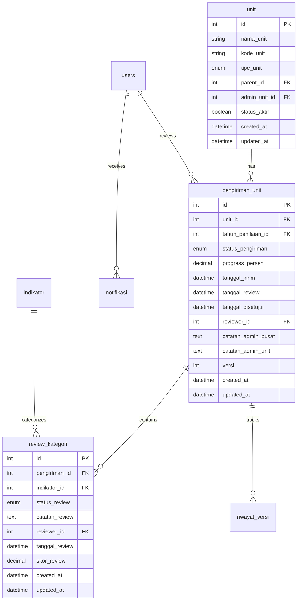

# Design Document

## Overview

Dashboard Admin Pusat UIGM POLBAN adalah sistem manajemen terpusat yang dirancang dengan arsitektur MVC (Model-View-Controller) menggunakan CodeIgniter 4. Sistem ini mengintegrasikan workflow review data dari multiple Admin Unit dengan interface yang konsisten, real-time notifications, dan comprehensive reporting capabilities.

## Architecture

### System Architecture

```
┌─────────────────┐    ┌─────────────────┐    ┌─────────────────┐
│   Admin Unit    │    │  Admin Pusat    │    │   Database      │
│   Dashboard     │◄──►│   Dashboard     │◄──►│   MySQL/MariaDB │
└─────────────────┘    └─────────────────┘    └─────────────────┘
         │                       │                       │
         └───────────────────────┼───────────────────────┘
                                 │
                    ┌─────────────────┐
                    │  Notification   │
                    │    System       │
                    └─────────────────┘
```

### Technology Stack

- **Backend**: CodeIgniter 4 (PHP 8.0+)
- **Database**: MySQL/MariaDB
- **Frontend**: HTML5, CSS3, JavaScript (ES6+)
- **UI Framework**: Bootstrap 5.3
- **Charts**: Chart.js
- **Icons**: Font Awesome 6.4
- **Fonts**: Inter (Google Fonts)

### Database Design



## Components and Interfaces

### 1. Dashboard Controller (AdminPusat.php)

**Primary Methods:**

- `index()` - Main dashboard view with statistics and data table
- `review($pengirimanId)` - Detailed review page for specific unit
- `updateReview()` - Process review updates and status changes
- `monitoring()` - Monitoring and reporting interface
- `notifikasi()` - Notification management

**Key Responsibilities:**

- Data aggregation and statistics calculation
- Review workflow management
- Real-time status updates
- Notification handling

### 2. Database Models

**UnitModel:**

```php
class UnitModel extends BaseModel
{
    protected $table = 'unit';
    protected $allowedFields = ['nama_unit', 'kode_unit', 'tipe_unit', 'parent_id', 'admin_unit_id', 'status_aktif'];

    public function getUnitsWithSubmissionStatus($tahunId) { /* ... */ }
    public function getUnitStatistics($tahunId) { /* ... */ }
}
```

**PengirimanUnitModel:**

```php
class PengirimanUnitModel extends BaseModel
{
    protected $table = 'pengiriman_unit';
    protected $allowedFields = ['unit_id', 'tahun_penilaian_id', 'status_pengiriman', 'progress_persen', /* ... */];

    public function getSubmissionsForReview($tahunId) { /* ... */ }
    public function updateSubmissionStatus($id, $status, $catatan) { /* ... */ }
}
```

**ReviewKategoriModel:**

```php
class ReviewKategoriModel extends BaseModel
{
    protected $table = 'review_kategori';
    protected $allowedFields = ['pengiriman_id', 'indikator_id', 'status_review', 'catatan_review', /* ... */];

    public function getReviewsBySubmission($pengirimanId) { /* ... */ }
    public function updateCategoryReview($pengirimanId, $indikatorId, $data) { /* ... */ }
}
```

### 3. View Components

**Layout Structure:**

```
layouts/admin_pusat.php
├── Header (Top Bar)
│   ├── Title & Breadcrumb
│   ├── Filters (Tahun, Unit, Status)
│   ├── Notification Icon
│   └── User Profile
├── Sidebar Navigation
│   ├── Dashboard
│   ├── Review Data
│   ├── Monitoring
│   ├── Notifikasi
│   └── Settings
└── Content Area
    └── Dynamic Content
```

**Dashboard Components:**

- Statistics Cards (4 cards with key metrics)
- Progress Bar (institutional progress)
- Data Table (submissions from units)
- Quick Actions Panel
- Recent Notifications

## Data Models

### Core Data Structures

**Unit Entity:**

```json
{
  "id": "integer",
  "nama_unit": "string",
  "kode_unit": "string (max 20)",
  "tipe_unit": "enum[fakultas, jurusan, unit_kerja, lembaga]",
  "parent_id": "integer|null",
  "admin_unit_id": "integer|null",
  "status_aktif": "boolean"
}
```

**Submission Entity:**

```json
{
  "id": "integer",
  "unit_id": "integer",
  "tahun_penilaian_id": "integer",
  "status_pengiriman": "enum[draft, dikirim, review, perlu_revisi, disetujui, final]",
  "progress_persen": "decimal(5,2)",
  "tanggal_kirim": "datetime|null",
  "tanggal_review": "datetime|null",
  "tanggal_disetujui": "datetime|null",
  "reviewer_id": "integer|null",
  "catatan_admin_pusat": "text|null",
  "catatan_admin_unit": "text|null",
  "versi": "integer"
}
```

**Category Review Entity:**

```json
{
  "id": "integer",
  "pengiriman_id": "integer",
  "indikator_id": "integer",
  "status_review": "enum[pending, disetujui, perlu_revisi]",
  "catatan_review": "text|null",
  "reviewer_id": "integer|null",
  "tanggal_review": "datetime|null",
  "skor_review": "decimal(8,2)|null"
}
```

### UIGM Categories Structure

```json
{
  "categories": [
    {
      "id": 1,
      "code": "SI",
      "name": "Setting & Infrastructure",
      "color": "#2E8B57",
      "weight": 15,
      "subcategories": ["campus_setting", "infrastructure"]
    },
    {
      "id": 2,
      "code": "EC",
      "name": "Energy & Climate Change",
      "color": "#FFD700",
      "weight": 21,
      "subcategories": ["energy_usage", "climate_change"]
    },
    {
      "id": 3,
      "code": "WS",
      "name": "Waste",
      "color": "#8B4513",
      "weight": 18,
      "subcategories": ["waste_treatment", "waste_recycling"]
    },
    {
      "id": 4,
      "code": "WR",
      "name": "Water",
      "color": "#1E90FF",
      "weight": 10,
      "subcategories": ["water_conservation", "water_usage"]
    },
    {
      "id": 5,
      "code": "TR",
      "name": "Transportation",
      "color": "#DC143C",
      "weight": 18,
      "subcategories": ["transportation_policy", "vehicle_usage"]
    },
    {
      "id": 6,
      "code": "ED",
      "name": "Education & Research",
      "color": "#5c8cbf",
      "weight": 18,
      "subcategories": ["sustainability_courses", "research_funding"]
    }
  ]
}
```

## Correctness Properties

_A property is a characteristic or behavior that should hold true across all valid executions of a system-essentially, a formal statement about what the system should do. Properties serve as the bridge between human-readable specifications and machine-verifiable correctness guarantees._

### Property Reflection

After analyzing all acceptance criteria, I identified several areas where properties can be consolidated to eliminate redundancy:

- **UI Consistency Properties**: Multiple properties about color usage, styling, and layout consistency can be combined into comprehensive consistency properties
- **Status Management Properties**: Properties about status updates, notifications, and workflow transitions can be consolidated
- **Data Synchronization Properties**: Properties about real-time updates and bidirectional sync can be unified
- **Category Processing Properties**: Properties that apply to "FOR EACH kategori" can be combined into single comprehensive properties

### Core Properties

**Property 1: Visual Consistency Enforcement**
_For any_ UI element that should follow POLBAN design standards, the element should use color #5c8cbf for primary elements, consistent typography and spacing, and matching card/table styles with Admin Unit
**Validates: Requirements 1.3, 10.1, 10.3, 10.4, 10.5**

**Property 2: Real-time Data Synchronization**
_For any_ data change in the system, all related statistics, status displays, and UI elements should update immediately to reflect the current state
**Validates: Requirements 2.6, 9.3, 9.4**

**Property 3: Status Badge Consistency**
_For any_ status value (Draft, Dikirim, Perlu Revisi, Disetujui), the system should display consistent badge styling and colors across all UI components
**Validates: Requirements 3.3, 10.4**

**Property 4: Review Button Conditional Display**
_For any_ unit with submitted data (status: dikirim, review, perlu_revisi), the system should display a Review button; for units without submitted data, no Review button should appear
**Validates: Requirements 3.4**

**Property 5: Data Ordering Consistency**
_For any_ list of submissions, the system should order them by tanggal_kirim in descending order (newest first)
**Validates: Requirements 3.5**

**Property 6: Navigation Behavior**
_For any_ Review button click, the system should navigate to the detailed review page for that specific unit
**Validates: Requirements 4.1**

**Property 7: Category Data Display Consistency**
_For any_ category in the review interface, the system should display Admin Unit data in read-only mode, show supporting documents, display Admin Unit notes, provide input field for Admin Pusat notes, and offer status selection options
**Validates: Requirements 4.5, 4.6, 4.7, 4.8, 4.9**

**Property 8: Revision Data Persistence**
_For any_ category marked as "Perlu Revisi", the system should save the revision notes and maintain the revision status until resolved
**Validates: Requirements 5.1**

**Property 9: Unit Status Calculation**
_For any_ unit review submission, if any category has status "Perlu Revisi", the overall unit status should be "Perlu Revisi"; if all categories are "Disetujui", the unit status should be "Disetujui"
**Validates: Requirements 5.2, 6.1**

**Property 10: Notification Generation**
_For any_ review action (submit, approve, reject, finalize), the system should generate appropriate notifications to the relevant Admin Unit
**Validates: Requirements 5.3, 5.5, 6.5, 8.1, 8.2**

**Property 11: Selective Category Access**
_For any_ unit with mixed category review statuses, Admin Unit should only have edit access to categories marked as "Perlu Revisi"
**Validates: Requirements 5.4**

**Property 12: Data Locking on Approval**
_For any_ unit with status "Disetujui", all data should become read-only for Admin Unit and the unit's score should be included in institutional aggregation
**Validates: Requirements 6.2, 6.3**

**Property 13: Timestamp Recording**
_For any_ finalization action, the system should record the exact timestamp of when the data was finalized
**Validates: Requirements 6.4**

**Property 14: Deadline Notification Behavior**
_For any_ approaching deadline, the system should generate reminder notifications to relevant users
**Validates: Requirements 8.3**

**Property 15: Notification Counter Accuracy**
_For any_ number of unread notifications, the badge counter should display the exact count of unread notifications
**Validates: Requirements 8.4**

**Property 16: Notification History Persistence**
_For any_ notification generated by the system, it should be stored in the notification history for future reference
**Validates: Requirements 8.5**

**Property 17: Category Structure Synchronization**
_For any_ UIGM category, the structure and fields should be identical between Admin Unit and Admin Pusat interfaces
**Validates: Requirements 9.1, 9.2**

**Property 18: Version History Tracking**
_For any_ data modification, the system should create and store a version history entry for audit purposes
**Validates: Requirements 9.5**

**Property 19: Pagination Behavior**
_For any_ data table with more than 50 records, the system should implement pagination to maintain performance
**Validates: Requirements 11.3**

**Property 20: Access Control Verification**
_For any_ dashboard access attempt, the system should verify Admin Pusat privileges before displaying the interface
**Validates: Requirements 12.1**

**Property 21: Activity Logging**
_For any_ review activity performed by Admin Pusat, the system should log the action in the audit trail
**Validates: Requirements 12.2**

**Property 22: Session Security Management**
_For any_ user session, the system should implement timeout mechanisms and maintain session security
**Validates: Requirements 12.4**

**Property 23: Input Validation Protection**
_For any_ user input field, the system should validate and sanitize input to prevent injection attacks
**Validates: Requirements 12.5**

## Error Handling

### Error Categories

**1. Database Connection Errors**

- Connection timeout handling
- Graceful degradation when database is unavailable
- Retry mechanisms for transient failures

**2. Data Validation Errors**

- Invalid status transitions
- Missing required fields
- Data type mismatches

**3. Authorization Errors**

- Insufficient privileges
- Session expiration
- Invalid access attempts

**4. Business Logic Errors**

- Attempting to review non-submitted data
- Finalizing incomplete reviews
- Duplicate submissions

### Error Response Strategy

```php
class ErrorHandler
{
    public function handleDatabaseError($exception) {
        // Log error, show user-friendly message, attempt recovery
        log_message('error', 'Database error: ' . $exception->getMessage());
        return redirect()->back()->with('error', 'Terjadi masalah koneksi database. Silakan coba lagi.');
    }

    public function handleValidationError($errors) {
        // Return validation errors with specific field information
        return redirect()->back()->withInput()->with('validation_errors', $errors);
    }

    public function handleAuthorizationError() {
        // Redirect to login or show access denied
        return redirect()->to('/auth/login')->with('error', 'Sesi Anda telah berakhir. Silakan login kembali.');
    }
}
```

## Testing Strategy

### Dual Testing Approach

The system will implement both **unit testing** and **property-based testing** as complementary approaches:

- **Unit tests**: Verify specific examples, edge cases, and error conditions
- **Property tests**: Verify universal properties across all inputs
- Both approaches together provide comprehensive coverage

### Unit Testing Focus Areas

Unit tests will concentrate on:

- Specific UI component rendering (dashboard cards, tables, forms)
- Integration points between Admin Unit and Admin Pusat systems
- Edge cases like empty data sets, maximum load scenarios
- Error conditions and exception handling

### Property-Based Testing Configuration

- **Testing Framework**: PHPUnit with custom property testing extensions
- **Minimum Iterations**: 100 iterations per property test
- **Test Tagging**: Each property test tagged with format: **Feature: dashboard-admin-pusat, Property {number}: {property_text}**

### Property Test Implementation Strategy

Each correctness property will be implemented as a single property-based test:

```php
/**
 * Feature: dashboard-admin-pusat, Property 1: Visual Consistency Enforcement
 * @test
 */
public function testVisualConsistencyEnforcement() {
    // Generate random UI elements that should follow POLBAN standards
    // Verify color #5c8cbf usage, typography, and styling consistency
}

/**
 * Feature: dashboard-admin-pusat, Property 9: Unit Status Calculation
 * @test
 */
public function testUnitStatusCalculation() {
    // Generate random combinations of category review statuses
    // Verify overall unit status calculation logic
}
```

### Testing Data Generation

Smart generators will be implemented to create realistic test data:

- **Unit Generator**: Creates various unit types (fakultas, jurusan, unit_kerja)
- **Submission Generator**: Creates submissions with different statuses and progress levels
- **Review Generator**: Creates category reviews with mixed approval/revision statuses
- **User Generator**: Creates Admin Pusat and Admin Unit users with appropriate permissions

### Performance Testing

- **Load Testing**: Verify system handles 50+ concurrent units
- **Response Time Testing**: Ensure dashboard loads within 3 seconds
- **Database Performance**: Monitor query execution times and optimize as needed

This comprehensive testing strategy ensures the Dashboard Admin Pusat meets all functional requirements while maintaining high performance and reliability standards.

<function_calls>
<invoke name="prework">
<parameter name="featureName">dashboard-admin-pusat
