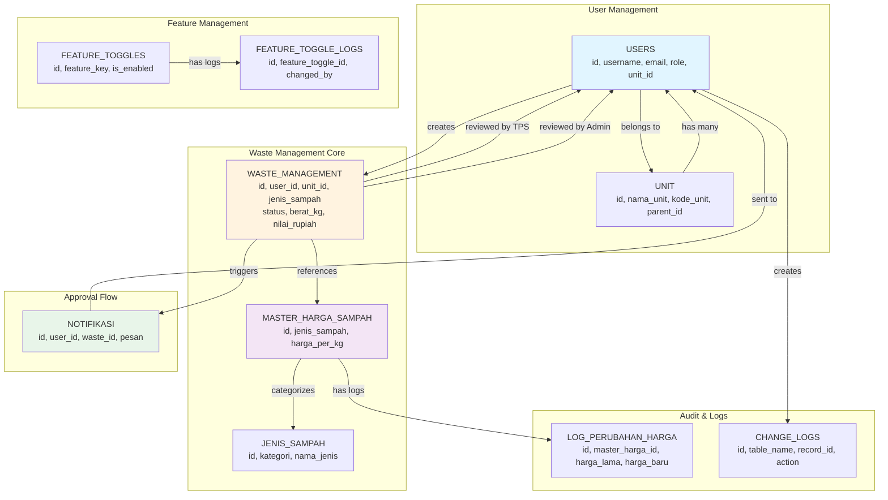
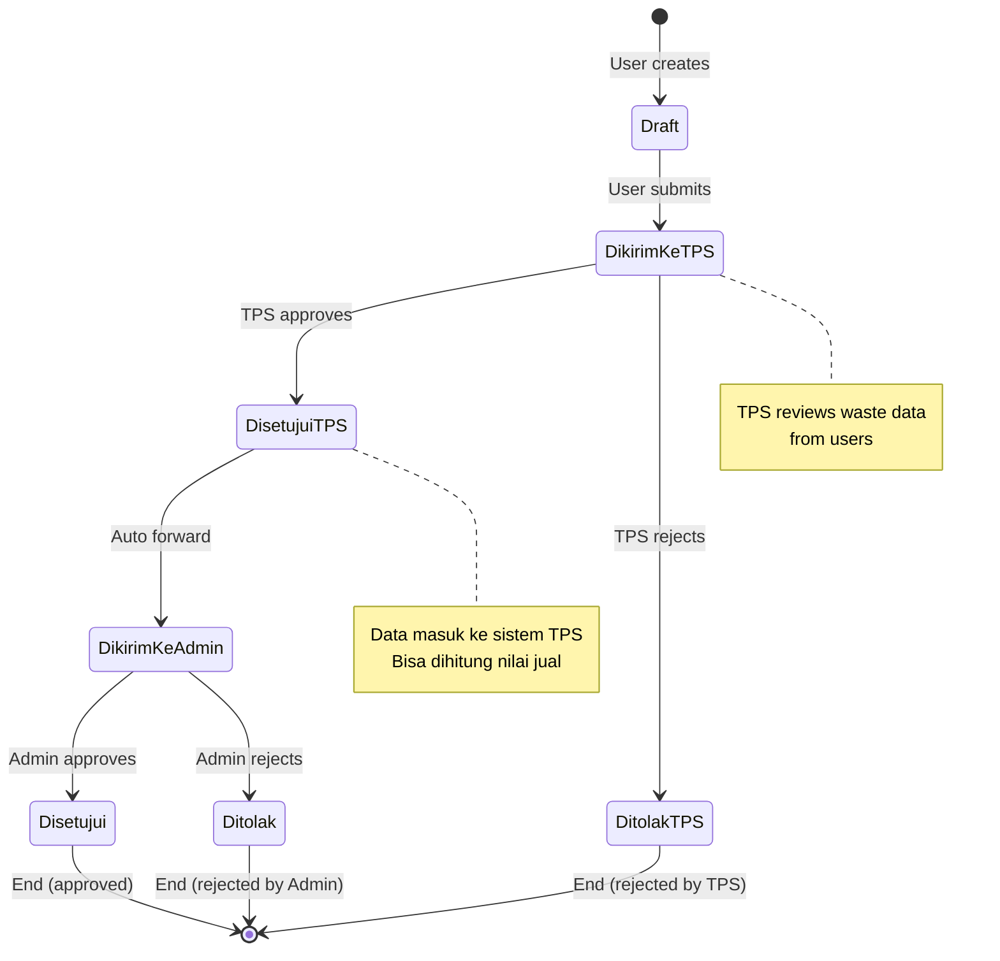
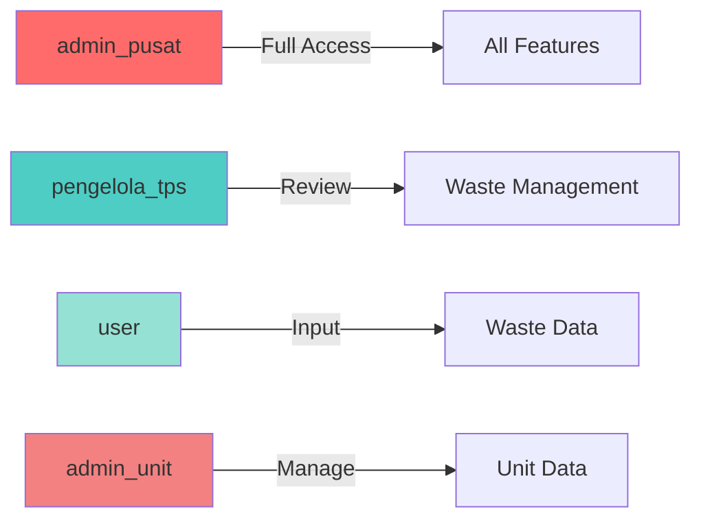

# ERD Simplified - UI GreenMetric POLBAN

## Diagram Relasi Utama

## Workflow Waste Management

## Database Tables Summary

| Table | Purpose | Key Fields |
|-------|---------|------------|
| **users** | User accounts | id, username, email, role, unit_id |
| **unit** | Organizational units | id, nama_unit, kode_unit, parent_id |
| **waste_management** | Waste data records | id, user_id, jenis_sampah, status, berat_kg |
| **master_harga_sampah** | Waste pricing master | id, jenis_sampah, harga_per_kg |
| **jenis_sampah** | Waste type details | id, kategori, nama_jenis |
| **notifikasi** | User notifications | id, user_id, waste_id, pesan |
| **log_perubahan_harga** | Price change audit | id, master_harga_id, harga_lama, harga_baru |
| **change_logs** | System audit trail | id, table_name, record_id, action |
| **feature_toggles** | Feature flags | id, feature_key, is_enabled |
| **dashboard_settings** | Dashboard config | id, setting_key, setting_value |

## User Roles & Permissions

## Key Relationships

### 1. User → Waste Management
- One user can create many waste records
- Each waste record belongs to one user

### 2. Unit → Users
- One unit has many users
- Each user belongs to one unit

### 3. Waste Management → Master Harga
- Waste records reference master pricing
- Pricing determines if waste can be sold

### 4. TPS Approval Flow
- User submits → TPS reviews → Admin reviews
- Each step has reviewer tracking

### 5. Notifications
- Triggered by status changes
- Sent to relevant users (submitter, reviewers)

## Status Values

### Waste Management Status
- `draft` - Initial state
- `dikirim_ke_tps` - Sent to TPS for review
- `disetujui_tps` - Approved by TPS
- `ditolak_tps` - Rejected by TPS
- `dikirim_ke_admin` - Sent to Admin
- `disetujui` - Final approval
- `ditolak` - Final rejection

### User Roles
- `admin_pusat` - Central admin
- `pengelola_tps` - TPS manager
- `user` - Regular user
- `admin_unit` - Unit admin

## Important Notes

1. **Waste Flow**: User → TPS → Admin (two-level approval)
2. **Pricing**: Dynamic pricing from master_harga_sampah
3. **Audit Trail**: All changes logged in change_logs
4. **Notifications**: Real-time updates for status changes
5. **Feature Toggles**: Enable/disable features per role
