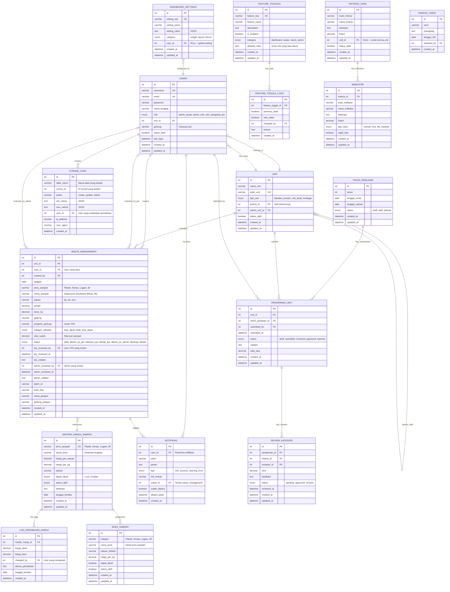

# Entity Relationship Diagram (ERD)
## UI GreenMetric POLBAN - Waste Management System



## Penjelasan Relasi Utama

### 1. User Management
- **USERS** → **UNIT**: Many-to-One (Setiap user belongs to satu unit)
- **UNIT** → **UNIT**: Self-referencing (Unit bisa punya parent unit)

### 2. Waste Management Flow
```
User Input → WASTE_MANAGEMENT (status: draft)
    ↓
Kirim ke TPS → (status: dikirim_ke_tps)
    ↓
TPS Review → (status: disetujui_tps / ditolak_tps)
    ↓
Admin Review → (status: disetujui / ditolak)
```

### 3. Pricing System
- **MASTER_HARGA_SAMPAH**: Master data harga sampah
- **JENIS_SAMPAH**: Detail jenis sampah dengan kategori
- **LOG_PERUBAHAN_HARGA**: Audit trail perubahan harga

### 4. Notification System
- **NOTIFIKASI**: Notifikasi untuk user terkait waste management
- Triggered by: approval, rejection, status changes

### 5. Feature Toggle System
- **FEATURE_TOGGLES**: Enable/disable fitur per role
- **FEATURE_TOGGLE_LOGS**: Audit trail perubahan feature

### 6. Assessment System (UI GreenMetric)
- **TAHUN_PENILAIAN**: Periode penilaian
- **KRITERIA_UIGM**: Kriteria penilaian (6 kategori)
- **INDIKATOR**: Indikator per kriteria
- **PENGIRIMAN_UNIT**: Submission dari unit
- **REVIEW_KATEGORI**: Review per kategori

## Status Flow Waste Management

```
draft → dikirim_ke_tps → disetujui_tps/ditolak_tps → dikirim_ke_admin → disetujui/ditolak
```

## User Roles

1. **admin_pusat**: Admin pusat (full access)
2. **admin_unit**: Admin unit (manage unit data)
3. **user**: User biasa (input waste data)
4. **pengelola_tps**: Pengelola TPS (review waste from users)

## Key Features

- ✅ Multi-level unit hierarchy
- ✅ Waste management with TPS approval flow
- ✅ Dynamic pricing system with audit trail
- ✅ Real-time notifications
- ✅ Feature toggle per role
- ✅ Change logs for audit
- ✅ UI GreenMetric assessment system
- ✅ Dashboard customization
